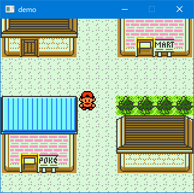
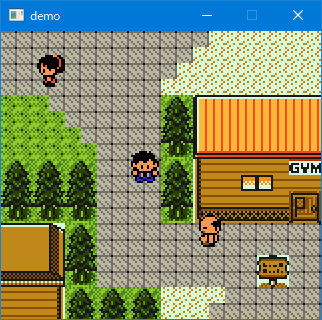
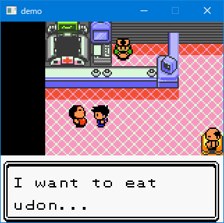

# PokeTraveler

**Note: This project is still in progress!**

A game that just roams the world of Pokemon GSC.

You don't have Pokemon and can just concentrate on enjoying walking around the Pokemon world!

&nbsp;&nbsp;&nbsp;&nbsp;  
&nbsp;&nbsp;&nbsp;&nbsp;

You can edit the world as you like by editing the asset folder.

Currently there is no other way than editing json directly, but I'll add a GUI editing tool in a future update.

## Usage

requirement: make and golang 1.13

```sh
$ git clone https://github.com/Akatsuki-py/PokeTraveler.git
$ make build
$ ./poketraveler
```